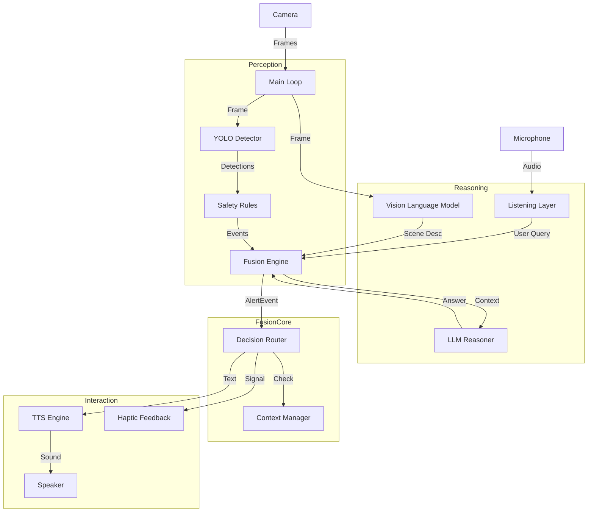

# WalkSense System Architecture

## 1. High-Level Data Flow

The WalkSense system processes data in a continuous loop, flowing from **Perception** (Sensors) -> **Fusion** (Decision Making) -> **Reasoning** (AI) -> **Interaction** (User Feedback).

## 2. Component Interactions

### A. Perception Layer (The "Fast" System)
- **Role:** Immediate hazard detection (30 FPS).
- **Components:** `YoloDetector`, `SafetyRules`.
- **Flow:**
  1. `YoloDetector` finds objects (e.g., "chair", "person").
  2. `SafetyRules` classifies them:
     - **CRITICAL** (Knife, Car) -> Immediate interrupt.
     - **WARNING** (Pole, Dog) -> Speak if not redundant.
     - **INFO** (Chair, Table) -> Speak if not redundant.

### B. Reasoning Layer (The "Slow" System)
- **Role:** Deep understanding and flexible queries (0.2 FPS).
- **Components:** `QwenVLM`, `LLMReasoner`.
- **Flow:**
  1. `QwenVLM` analyzes scene logic every few seconds.
  2. If the user asks a question, `FusionEngine` sends the query + scene to `LLMReasoner`.
  3. `LLMReasoner` generates a natural language answer.

### C. Fusion & Routing (The "Brain")
- **Role:** Prioritization and Orchestration.
- **Problem Identification (The Suppression Issue):**
  - The `YoloDetector` runs fast (30 times/sec).
  - The `SafetyRules` generates "INFO" events for common objects (like chairs) on *every frame*.
  - The `DecisionRouter` receives these events.
  - **The Bug:** Historically, `INFO` events were deemed "low risk" but **lacked a redundancy check**.
  - **Result:** The system shouts "Chair nearby" -> "Chair nearby" -> "Chair nearby" 30 times a second.
  - **Consequence:** This floods the `TTS` queue. When the "Slow" Reasoning layer finally has an intelligent answer ("The chair is to your left"), it tries to speak, but is immediately interrupted by the next "Chair nearby" signal from the fast Perception layer.

## 3. The Fix Strategy

To stop the "Yolo Layer" from suppressing the "Fusion Layer":

1. **Separate INFO from RESPONSE**: 
   - `INFO` (Safety) needs strict redundancy checks (don't repeat "chair" for 10 seconds).
   - `RESPONSE` (AI Answer) should be allowed to speak freely.

2. **Implement Throttling**:
   - Ensure `DecisionRouter` blocks `INFO` messages if they are too similar to the last spoken message.
