# WalkSense Architecture

## System Overview

WalkSense is an AI-powered assistive navigation system designed for visually impaired users. It combines real-time object detection, vision-language understanding, and natural language interaction to provide intelligent scene understanding and safety alerts.

## Architecture Diagram

```mermaid
graph TB
    %% User Input Layer
    User[👤 User] -->|Voice Query| IL[Interaction Layer]
    Camera[📷 Camera Feed] --> PL[Perception Layer]
    
    %% Perception Layer
    subgraph PL[🔍 Perception Layer]
        direction TB
        CAM[Camera Module<br/>perception_layer/camera.py]
        YOLO[YOLO Detector<br/>perception_layer/detector.py]
        RULES[Safety Rules<br/>perception_layer/rules.py]
        ALERTS[Alert Events<br/>perception_layer/alerts.py]
        
        CAM --> YOLO
        YOLO --> RULES
        RULES --> ALERTS
    end
    
    %% Reasoning Layer
    subgraph RL[🧠 Reasoning Layer]
        direction TB
        VLM[Vision-Language Model<br/>reasoning_layer/vlm.py]
        LLM[Language Model<br/>reasoning_layer/llm.py]
        
        VLM <--> LLM
    end
    
    %% Fusion Layer
    subgraph FL[⚡ Fusion Layer]
        direction TB
        ENGINE[Fusion Engine<br/>fusion_layer/engine.py]
        CONTEXT[Spatial Context<br/>fusion_layer/context.py]
        ROUTER[Decision Router<br/>fusion_layer/router.py]
        STATE[Runtime State<br/>fusion_layer/state.py]
        REDUN[Redundancy Filter<br/>fusion_layer/redundancy.py]
        
        ENGINE --> ROUTER
        ENGINE --> CONTEXT
        ROUTER --> STATE
        ROUTER --> REDUN
    end
    
    %% Interaction Layer
    subgraph IL[🎤 Interaction Layer]
        direction TB
        STT[Speech-to-Text<br/>interaction_layer/stt.py]
        TTS[Text-to-Speech<br/>interaction_layer/tts.py]
        AUX[Auxiliary I/O<br/>interaction_layer/auxiliary.py]
        HAPTIC[Haptics]
        BUZZER[Buzzer]
        LED[LED]
        
        STT --> TTS
        AUX --> HAPTIC
        AUX --> BUZZER
        AUX --> LED
    end
    
    %% Infrastructure Layer
    subgraph INFRA[🛠️ Infrastructure]
        direction TB
        CONFIG[Config Loader<br/>infrastructure/config.py]
        PERF[Performance Tracker<br/>infrastructure/performance.py]
        SAMPLER[Frame Sampler<br/>infrastructure/sampler.py]
        SCENE[Scene Change Detector<br/>infrastructure/scene.py]
    end
    
    %% Data Flow
    PL -->|Object Detections| FL
    PL -->|Safety Alerts| FL
    PL -->|Video Frames| RL
    
    RL -->|Scene Description| FL
    RL -->|Query Response| FL
    
    FL -->|Audio Commands| IL
    FL -->|Haptic Feedback| IL
    
    IL -->|User Queries| FL
    IL -->|Audio Output| User
    IL -->|Haptic/Visual| User
    
    INFRA -.->|Configuration| PL
    INFRA -.->|Configuration| RL
    INFRA -.->|Configuration| FL
    INFRA -.->|Configuration| IL
    
    style PL fill:#e1f5ff
    style RL fill:#fff4e1
    style FL fill:#ffe1f5
    style IL fill:#e1ffe1
    style INFRA fill:#f5f5f5
```



## Layer Architecture

### 1. Perception Layer (`perception_layer/`)

**Purpose**: Raw sensory input processing and immediate safety detection.

**Components**:
- **Camera** (`camera.py`): Captures video frames from hardware or simulation
- **YOLO Detector** (`detector.py`): Real-time object detection using YOLOv8/v11
- **Safety Rules** (`rules.py`): Deterministic hazard classification (Critical, Warning, Info)
- **Alert Events** (`alerts.py`): Data structures for safety notifications

**Data Flow**:
```
Camera → YOLO Detection → Safety Rules → Alert Events → Fusion Layer
```

**Key Features**:
- Hardware/simulation mode switching
- GPU-accelerated YOLO inference
- Multi-tier hazard classification
- Sub-second detection latency

---

### 2. Reasoning Layer (`reasoning_layer/`)

**Purpose**: High-level AI understanding and contextual reasoning.

**Components**:
- **Vision-Language Model** (`vlm.py`): Scene description using Qwen2-VL or LM Studio
- **Language Model** (`llm.py`): Query answering and contextual reasoning

**Data Flow**:
```
Video Frame + Context → VLM → Scene Description → LLM → Natural Language Response
```

**Key Features**:
- Multi-backend support (LM Studio, HuggingFace, Ollama)
- Query-focused scene analysis
- Factual grounding checks
- Concise, Jarvis-style responses

---

### 3. Fusion Layer (`fusion_layer/`)

**Purpose**: Orchestrates perception, reasoning, and interaction; manages system state.

**Components**:
- **Fusion Engine** (`engine.py`): Central coordinator for all subsystems
- **Spatial Context Manager** (`context.py`): Object tracking and spatial-temporal awareness
- **Decision Router** (`router.py`): Prioritizes and routes alerts to appropriate outputs
- **Runtime State** (`state.py`): Manages alert cooldowns and system state
- **Redundancy Filter** (`redundancy.py`): Prevents duplicate or similar alerts

**Data Flow**:
```
Perception + Reasoning → Fusion Engine → Decision Router → Interaction Layer
                              ↓
                      Spatial Context Manager
```

**Key Features**:
- Priority-based alert routing
- IoU-based object tracking
- Intelligent redundancy suppression
- Multi-modal output coordination

---

### 4. Interaction Layer (`interaction_layer/`)

**Purpose**: User communication through speech, audio, and haptic feedback.

**Components**:
- **Speech-to-Text** (`stt.py`): Voice input using Whisper/Google/faster-whisper
- **Text-to-Speech** (`tts.py`): Audio output using pyttsx3
- **Auxiliary Controller** (`auxiliary.py`): Coordinates haptics, buzzer, and LED
- **Hardware Drivers**: Haptics, Buzzer, LED modules

**Data Flow**:
```
User Voice → STT → Fusion Layer → TTS → Audio Output
                    ↓
              Auxiliary I/O → Haptics/Buzzer/LED
```

**Key Features**:
- Multi-provider STT (Whisper local/API, Google)
- GPU-accelerated transcription
- Non-blocking audio playback
- Multi-modal feedback (audio + haptic + visual)

---

### 5. Infrastructure (`infrastructure/`)

**Purpose**: Cross-cutting utilities and configuration management.

**Components**:
- **Config Loader** (`config.py`): Centralized JSON-based configuration
- **Performance Tracker** (`performance.py`): Latency monitoring and visualization
- **Frame Sampler** (`sampler.py`): Controls VLM inference frequency
- **Scene Change Detector** (`scene.py`): Detects significant visual changes

**Features**:
- Hot-reloadable configuration
- Per-component performance metrics
- Intelligent sampling to reduce compute load
- Histogram-based scene change detection

---

## Data Flow Diagram


---

## Technology Stack

### Core Technologies
- **Python 3.10+**: Primary language
- **PyTorch**: Deep learning framework
- **OpenCV**: Computer vision and video processing
- **Ultralytics YOLO**: Object detection
- **Transformers**: Vision-language models

### AI Models
- **YOLO v8/v11**: Object detection (yolov8n, yolo11m)
- **Qwen2-VL**: Vision-language understanding
- **Gemma3/Phi-4**: Language reasoning

### Speech & Audio
- **faster-whisper**: GPU-accelerated speech recognition
- **pyttsx3**: Text-to-speech synthesis
- **SpeechRecognition**: Audio input handling

### Infrastructure
- **loguru**: Structured logging
- **matplotlib/seaborn**: Performance visualization
- **NumPy/Pandas**: Data processing

---

## Configuration Management

All system parameters are centralized in `config.json`:

```json
{
    "vlm": { "active_provider": "lm_studio", ... },
    "llm": { "active_provider": "ollama", ... },
    "stt": { "active_provider": "whisper_local", ... },
    "detector": { "device": "cuda", ... },
    "safety": { "alert_cooldown": 20.0, ... }
}
```

**Benefits**:
- Single source of truth
- Easy provider switching
- No code changes for configuration updates
- Environment-specific settings

---

## Performance Characteristics

### Latency Targets
- **YOLO Detection**: ~500ms (GPU) / ~800ms (CPU)
- **VLM Description**: ~2-5s (depends on model size)
- **LLM Reasoning**: ~1-2s
- **STT Transcription**: ~500ms (GPU) / ~2-3s (CPU)
- **End-to-End Query**: ~5-10s

### Optimization Strategies
1. **Async VLM Processing**: Non-blocking inference via worker threads
2. **Smart Sampling**: VLM only runs every 150 frames or on scene change
3. **GPU Acceleration**: CUDA for YOLO, Whisper, and models
4. **Alert Deduplication**: Redundancy filters prevent spam
5. **Lazy Model Loading**: Models loaded on first use

---

## Deployment Architecture

```
WalkSense/
├── perception_layer/      # Input processing
├── reasoning_layer/       # AI inference
├── fusion_layer/         # Orchestration
├── interaction_layer/    # User I/O
├── infrastructure/       # Utilities
├── scripts/             # Entry points
├── models/              # Model weights
├── logs/                # Performance data
└── config.json          # System configuration
```

---

## Extension Points

### Adding New Components

1. **New STT Provider**:
   - Add provider config to `config.json`
   - Implement recognition method in `interaction_layer/stt.py`

2. **New VLM Backend**:
   - Add backend config to `config.json`
   - Implement `_init_<backend>()` and `describe_scene_<backend>()` in `reasoning_layer/vlm.py`

3. **New Safety Rules**:
   - Add object classes to `perception_layer/rules.py`
   - Define severity thresholds

4. **New Output Modality**:
   - Create driver in `interaction_layer/`
   - Register with `AuxController`

---

## Security & Privacy

- **Local Processing**: All AI inference runs locally (no cloud API calls by default)
- **No Data Collection**: Video frames are not stored or transmitted
- **Configurable Backends**: Users can choose between local and API-based models
- **Minimal Dependencies**: Only essential libraries included

---

## Future Enhancements

1. **Navigation Mode**: Turn-by-turn directions
2. **Text Recognition**: OCR for signs and labels
3. **Face Recognition**: Identify known individuals
4. **Depth Sensing**: Integration with depth cameras
5. **Mobile App**: Smartphone companion app
6. **Cloud Sync**: Optional cloud backup for preferences

---

## Troubleshooting Guide

### Common Issues

**Issue**: CUDA not available
- **Solution**: Install CUDA-enabled PyTorch: `pip install torch --index-url https://download.pytorch.org/whl/cu124`

**Issue**: Slow STT transcription
- **Solution**: Enable GPU in `config.json`: `"stt.providers.whisper_local.device": "cuda"`

**Issue**: VLM not responding
- **Solution**: Check LM Studio is running and model is loaded

**Issue**: Audio not playing
- **Solution**: Verify `interaction_layer/audio_worker.py` has correct Python path

---

## Performance Monitoring

Access real-time performance metrics:
- **Console Logs**: Filtered to show USER/AI interactions
- **Performance Log**: `logs/performance.log` (all events)
- **Visualization**: `plots/performance_summary.png` (generated on exit)

Example metrics:
```
YOLO: avg 277ms, max 684ms
VLM: avg 3200ms, max 5000ms
STT: avg 500ms (GPU), 2500ms (CPU)
```

---

## Contributing

See project structure above for adding new features. Key principles:
1. **Layer Separation**: Keep perception, reasoning, and interaction separate
2. **Configuration-Driven**: Use `config.json` for all tunables
3. **Type Hints**: Include type annotations and docstrings
4. **Logging**: Use `loguru` for all output
5. **Performance**: Track latency for major operations

---

## License

This project is part of the WalkSense assistive navigation system.
